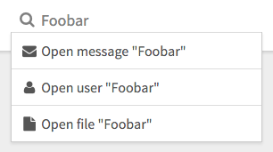

# Search Palette

Search input with a results autocompleter.



```jsx
import ChannelList from 'patchkit-channel-list'

const openUser = str => console.log('open user', str)
const openMsg  = str => console.log('open msg', str)
const openFile = str => console.log('open file', str)

const getResults = str => [
  { icon: 'envelope', label: `Open message "${str}"`, fn: openMsg },
  { icon: 'user',     label: `Open user "${str}"`,    fn: openUser },
  { icon: 'file',     label: `Open file "${str}"`,    fn: openFile }
]

<SearchPalette placeholder="Enter your query" getResults={getResults} />
```

## Styles

Use the .less file:

```less
@import "node_modules/patchkit-search-palette/styles.less"
```